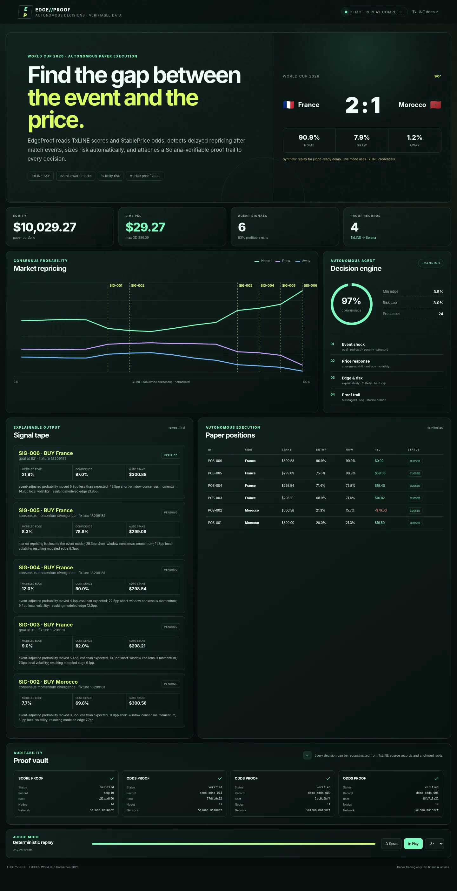

# EdgeProof

**Autonomous, explainable World Cup trading signals powered by verifiable TxLINE data.**

Built for the TxODDS World Cup hackathon (*Trading Tools and Agents* track).

<p align="center">
  <a href="https://edgeproof.onrender.com"></a>
  <a href="https://github.com/RadhaJivanadas/edgeproof/actions/workflows/ci.yml"></a>
  
  
  
</p>

**Live demo:** https://edgeproof.onrender.com &nbsp;·&nbsp; **Demo video:** https://www.youtube.com/watch?v=zPTN3mVInTg &nbsp;·&nbsp; **Data provenance:** [`data/replay-meta.json`](data/replay-meta.json)



EdgeProof connects granular TxLINE score events with StablePrice consensus odds. It detects cases where the market has not fully repriced after a goal, red card, penalty, or sustained pressure; explains the discrepancy; opens a risk-capped paper position; and stores the TxLINE identifiers needed to obtain a Solana Merkle proof.

## What makes it different

Most trading-agent demos stop at "odds moved by X%". EdgeProof closes the loop:

1. Score events and market probabilities are processed together, so a goal and its repricing are one observation, not two feeds.
2. Signals, position sizing, entries, marks, and exits run without manual input.
3. Every signal states the expected event shock, the actual repricing, momentum, volatility, edge, confidence, and stake.
4. Every decision keeps `MessageId`, timestamp, fixture ID, and score `seq`; live mode fetches `/api/odds/validation` and `/api/scores/stat-validation` Merkle proofs.

## The judge replay

The public deployment runs a deterministic replay, so judges can open and test the product without buying a subscription, creating a wallet, or waiting for a live fixture.

The bundled replay is real TxLINE data: **Spain vs Argentina, 19 July 2026** (fixture `18257739`), captured from the authenticated historical endpoints as 199 score records, 420 StablePrice 1X2 ticks, and 2 validation proofs. The match turned out to be a useful stress test: three goal records, two of them overturned by VAR. When the scoreboard rolls back during playback, that is the actual record stream, and the dashboard labels the overturn. Provenance lives in [`data/replay-meta.json`](data/replay-meta.json).

To capture a different fixture, list covered fixtures and pick one in the historical window:

```bash
TXLINE_API_TOKEN="..." npm run fixtures:txline

TXLINE_API_TOKEN="..." \
TXLINE_FIXTURE_ID="..." \
npm run capture:txline
```

This downloads authenticated historical scores and odds, filters them to one fixture, captures available validation proofs, and rewrites `data/txline-replay.json` plus `data/replay-meta.json`. `render.yaml` already points `REPLAY_FILE` at the capture. Credentials are never written to the replay or the repository.

## Run locally

Requirements: Node.js 20+.

```bash
npm ci
npm test
npm start
```

Open `http://localhost:3000`. The replay starts automatically. Use Reset, Play/Pause, and 1×–8× controls.

## Connect live TxLINE data

1. Subscribe to a free World Cup tier and activate an API token using the official TxLINE quickstart.
2. Set the environment variables:

```bash
DATA_MODE=txline
TXLINE_BASE_URL=https://txline.txodds.com
TXLINE_JWT=
TXLINE_API_TOKEN=<activated API token>
TXLINE_FIXTURE_ID=<covered fixture ID>
HOME_TEAM=<home team label>
AWAY_TEAM=<away team label>
COMPETITION_NAME=<competition label>
```

3. Run:

```bash
npm start
```

`TXLINE_JWT` is optional because EdgeProof obtains and renews the guest JWT automatically.

Live mode seeds the dashboard from:

- `GET /api/odds/snapshot/{fixtureId}`
- `GET /api/scores/snapshot/{fixtureId}`

It then reconnects automatically to:

- `GET /api/odds/stream`
- `GET /api/scores/stream`

Proof requests use:

- `GET /api/odds/validation?messageId=...&ts=...`
- `GET /api/scores/stat-validation?fixtureId=...&seq=...&statKeys=1,2`

## Strategy

For each eligible 1X2 result update, EdgeProof:

1. normalizes the `Pct` array into home/draw/away probabilities;
2. estimates the immediate impact of the most recent score event;
3. compares expected impact with actual StablePrice movement;
4. adds short-window consensus momentum and penalizes local volatility;
5. emits only when modeled edge and confidence exceed hard thresholds;
6. sizes a paper position with half-Kelly, capped at 3% of bankroll;
7. marks the position to the next TxLINE updates and closes after edge realization or a final marker.

The model is deliberately transparent. It is a hackathon-grade baseline designed to be calibrated on TxLINE historical replay without changing the ingestion, execution, proof, or UX layers.

## Architecture

```text
TxLINE scores snapshot/SSE ─┐
                            ├─> normalizer ─> event/price agent ─> paper executor
TxLINE odds snapshot/SSE ───┘                       │
                                                    ├─> explainable signal tape
TxLINE validation endpoints ─> proof vault <────────┘
```

- `server.js`: zero-dependency Node HTTP/SSE server and orchestration
- `src/txline-client.js`: snapshots, historical data, streaming, reconnects, proof endpoints
- `src/agent.js`: normalizers, edge model, confidence, Kelly sizing, portfolio state
- `src/replay.js`: deterministic judge replay
- `scripts/capture-txline-replay.js`: creates a real TxLINE-backed replay
- `public/`: responsive dashboard, no build step
- `data/replay-meta.json`: visible data provenance

## API

- `GET /api/health`
- `GET /api/state`
- `GET /api/events`: dashboard SSE
- `POST /api/replay/start|pause|reset|speed`: replay mode
- `GET /api/txline/proof?messageId=...&ts=...`: live mode

## Validation

```bash
npm test
npm run preflight
```

GitHub Actions runs both commands on every push and pull request.

## Safety

This project is a research and paper-trading tool. It does not place real-money bets and is not financial advice.
